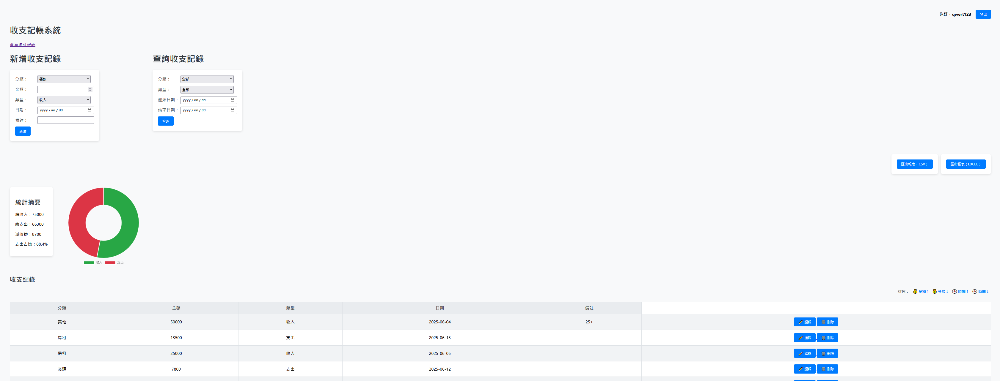
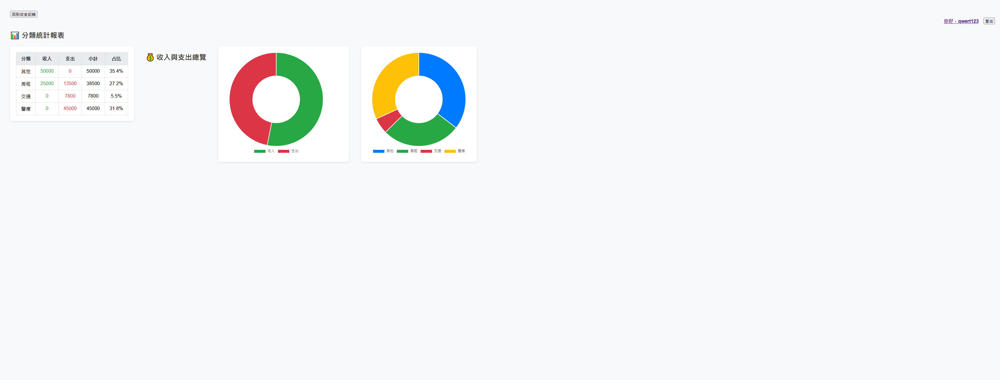
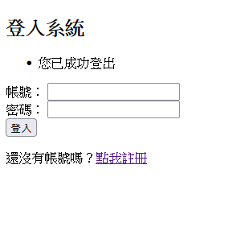
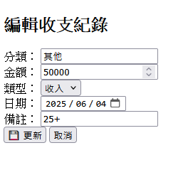

# 📒 Flask 記帳系統

這是一個用 Flask 打造的個人記帳系統，支援：
- 使用者註冊 / 登入 / 登出
- 收支資料查詢、分類、篩選
- 統計圖表分析（含 Doughnut 圖）
- CSV / Excel 報表匯出
- 每筆資料的編輯 / 刪除
- 登入者資料隔離（安全性完整）

---

## 🛠️ 使用技術

- Python 3.x
- Flask
- SQLAlchemy + SQLite
- Flask-Login
- Jinja2
- openpyxl / pandas
- Chart.js

---

## 📂 專案結構

```text
flask-accounting-app/
├── app.py                  # 主程式入口
├── models.py               # 資料庫模型定義
├── routes/                 # 路由模組
│   ├── __init__.py         # 藍圖註冊
│   ├── auth.py             # 註冊 / 登入
│   ├── expense.py          # 收支操作
│   ├── export.py           # 匯出報表
│   └── summary.py          # 統計報表
├── utils/                  # 輔助邏輯模組
│   ├── helpers.py          # 查詢參數處理
│   └── report_service.py   # 匯出報表邏輯
├── templates/              # Jinja2 HTML 模板
│   ├── login.html
│   ├── register.html
│   ├── expenses.html
│   ├── summary.html
│   ├── edit_expense.html
│   └── confirm_delete.html
├── static/                 # 靜態資源（樣式、圖表等）
├── screenshots/            # 📸 專案畫面截圖
│   ├── login_page.png
│   ├── view_page.png
│   ├── edit_page.png
│   └── chart_page.png
├── requirements.txt
├── .gitignore
└── README.md               # 本說明文件

```
---

## 🖼 預覽畫面


> - 記帳清單畫面
> 
> - 圖表頁面（分類占比、收入支出總覽）
> 
> -登入頁面
> 
> - 編輯 / 刪除介面
> 
> 

---

## 🚀 如何啟動專案

```bash
# 安裝套件
pip install -r requirements.txt

# 執行主程式
python app.py

# 預設在 http://localhost:5000 執行

```

## 👨‍💻 作者資訊

Jimmy Lin（林翰頡）
📌 技術轉職中，擁有 3D 遊戲美術背景，現正朝向 Python 後端開發領域發展。


